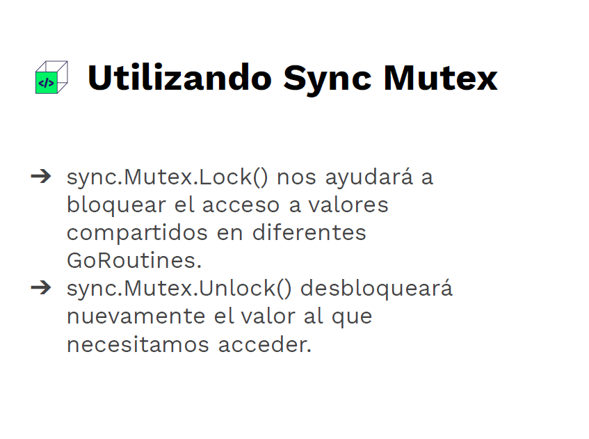

# Go Avanzado: Concurrencia y Patrones de Diseño

# Indice
- [Introducción](#Introducción)
- [Concurrencia](#Concurrencia)
  - [Contenido](#Contenido)
  - [Utilizando Sync Mutex](#Utilizando-Sync-Mutex)
  - [Sistemas de Cache Concurrentes](#Sistemas-de-Cache-Concurrentes)
- [Patrones de diseño](#Patrones-de-diseño)
  - [Factory](#Factory)
  - [Singleton](#Singleton)
  - [Adapter](#Adapter)
  - [Observer](#Observer)
  - [Strategy](#Strategy)
- [Net](#Net)
  - [Escáner de Puertos Concurrente](#Escáner-de-Puertos-Concurrente)
  - [Chat](#Chat)

# Introducción

- Go soporta la concurrencia de manera nativa, no mediante el uso de librerías o paquetes externos.
- Go utiliza un modelo de concurrencia llamado CSP (Communicating Sequential Processes).
- Estas GoRoutines son inicializadas con un stack de 2KB. En comparación, Java utiliza threads de aproximadamente 1MB.
- Para comunicarse se utilizan Channels, que pueden ser “buffered” o “unbuffered”.
- Diferentes técnicas para sincronización, tales como WaitGroups e iteración en Channels.
- Go implementa interfaces de manera implícita, sin palabras clave como implements
- Potente librería estándar que permite muchas de las habilidades que se requieren para la construcción de programas robustos
- Prometheus, Helm, etcd, containerd, Jaeger, gRPC y NATS son algunos de los proyectos que más llaman la atención en Go.

# Concurrencia

## Contenido

- **Concurrencia de un valor compartido**: cómo puedo sincronizar las GoRoutines cuando están accediendo al mismo valor y evitar la condición de carrera.
- **Patrones de diseño:** aquellos más frecuentes y que mejores resultados traerán a nuestros problemas.
- **Utilizar el paquete Net** para la creación de conexiones TCP que permiten diferentes utilidades como escanear puertos entre otros.

## Utilizando Sync Mutex



- Lock bloquea lecturas (con RLock) y escrituras (con Lock) de otras goroutines
- Unlock permite nuevas lecturas (con Rlock) o otra escritura (con Lock)
- RLock bloquea escrituras (Lock) pero no bloquea lecturas (RLock)
- RUnlock permite nuevas escrituras (y también lecturas, pero por la naturaleza de RLock, estas no se vieron bloqueadas nunca)
    
```go
package main

import (
	"fmt"
	"sync"
)

var (
	balance int = 100
)

func Deposit(amount int, wg *sync.WaitGroup, lock *sync.RWMutex) {
	defer wg.Done()
	lock.Lock()
	b := balance
	balance = b + amount
	lock.Unlock()
}

func Balance(lock *sync.RWMutex) int {
	lock.RLock()
	b := balance
	lock.RUnlock()
	return b
}

func main() {

	var wg sync.WaitGroup
	var lock sync.RWMutex

	for i := 1; i <= 5; i++ {
		wg.Add(1)
		go Deposit(i*100, &wg, &lock)
	}

	wg.Wait()
	fmt.Println(Balance(&lock))

}
```
    
## Sistemas de Cache Concurrentes

```go
package main

import (
	"fmt"
	"log"
	"sync"
	"time"
)

// Funcion con costo computacional alto
func Fibonacci(n int) int {
	if n <= 1 {
		return n
	}
	return Fibonacci(n-1) + Fibonacci(n-2)
}

// Memory hara cache apartir de la resultados de la funcion y los guardara en un map
type Memory struct {
	f     Function
	cache map[int]FunctionResult
	lock  sync.RWMutex
}

// La funcion para hacer cache devuelve un tipo generico y un error
type Function func(key int) (interface{}, error)

// El resultado que se guardara en un struct con el valor o su posible error
type FunctionResult struct {
	value interface{}
	err   error
}

//Constructor
func NewCache(f Function) *Memory {
	return &Memory{
		f:     f,
		cache: make(map[int]FunctionResult),
	}
}

// Metodo para obtener un valor de la cache, si no existe lo calcula y lo guarda
func (m *Memory) Get(key int) (interface{}, error) {
	m.lock.Lock()
	result, exists := m.cache[key]
	m.lock.Unlock()

	if !exists {
		m.lock.Lock()
		result.value, result.err = m.f(key)
		m.cache[key] = result
		m.lock.Unlock()
	}

	return result.value, result.err
}

func GetFibonacci(n int) (interface{}, error) {
	return Fibonacci(n), nil
}

func main() {
	cache := NewCache(GetFibonacci)
	fibo := []int{42, 42, 41, 42, 38, 45, 45}
	var wg sync.WaitGroup

	for _, n := range fibo {
		wg.Add(1)
		go func(index int) {
			defer wg.Done()
			start := time.Now()
			value, err := cache.Get(index)
			if err != nil {
				log.Println(err)
			}
			fmt.Printf("N:%d, T:%s, R:%d\n", index, time.Since(start), value)
		}(n)
	}
	wg.Wait()
}
```
    
```go
package main

import (
	"fmt"
	"sync"
	"time"
)

func ExpensiveFibonacci(n int) int {
	fmt.Printf("Calculating Expensive Fibonacci for %d\n", n)
	time.Sleep(5 * time.Second)
	return n
}

type Service struct {
	// Map de los jobs que se estan calculando
	InProgress map[int]bool
	// Map de chans que esperan el resultado de una operacion en progreso
	IsPending map[int][]chan int
	// Candado para la lectura de los dos maps
	Lock      sync.RWMutex
}

func (s *Service) Work(job int) {
	s.Lock.RLock()
	exists := s.InProgress[job]
	if exists {
		s.Lock.RUnlock()
		responseChan := make(chan int)
		defer close(responseChan)
		
		s.Lock.Lock()
		s.IsPending[job] = append(s.IsPending[job], responseChan)
		s.Lock.Unlock()
		fmt.Printf("Waiting for Response job: %d\n", job)
		res := <-responseChan
		fmt.Printf("Response Done,received %d\n", res)
		return
	}
	s.Lock.RUnlock()

	s.Lock.Lock()
	s.InProgress[job] = true
	s.Lock.Unlock()

	fmt.Printf("Calculate Fibonacci for %d\n", job)
	result := ExpensiveFibonacci(job)

	s.Lock.RLock()
	pendingWorkers, exists := s.IsPending[job]
	s.Lock.RUnlock()

	if exists {
		for _, pendingWorker := range pendingWorkers {
			pendingWorker <- result
		}
		fmt.Printf("Result sent - all pending workers ready job:%d\n", job)
	}

	s.Lock.Lock()
	s.InProgress[job] = false
	s.IsPending[job] = make([]chan int, 0)
	s.Lock.Unlock()

}

func NewService() *Service {
	return &Service{
		InProgress: make(map[int]bool),
		IsPending:  make(map[int][]chan int),
	}
}

func main() {

	service := NewService()
	jobs := []int{3, 4, 5, 5, 4, 8, 8, 8}
	var wg sync.WaitGroup
	wg.Add(len(jobs))
	for _, n := range jobs {
		go func(job int) {
			defer wg.Done()
			service.Work(job)
		}(n)
	}
	wg.Wait()
}
```
    
# Patrones de diseño

Son planos que nos ayuda a solventar problemas muy comunes a la hora de diseñar software, estos planos los podemos adaptar a nuestras necesidades y a lenguajes de programación específicos.

Los patrones de diseño se categorizan en:

1. **Patrones creacionales:** Establecen mecanismos para que la creación de objetos pueda ser reutilizable y flexible. Ejemplo: Factory y Singleton.
2. **Patrones estructurales:** Establecen mecanismos de como crear objetos en estructuras mas grandes sin perder esa flexibilidad y reusabilidad. Ejemplo: Adapter.
3. **Patrones de comportamiento:** Establecen mecanismos de comunicación efectiva entre estos objetos, asimismo la asignación de responsabilidades de estos. Ejemplo: Observer y Strategy.

## Factory

[Factory Method](https://refactoring.guru/es/design-patterns/factory-method)

Es un patrón creacional, que nos permite crear una "fabrica" de objetos a partir de una clase base y a su vez va implementar comportamientos polimórficos que permite modificar el comportamiento de las clases heredadas.

```go
package main

import "fmt"

type IProduct interface {
	setStock(stock int)
	getStock() int
	setName(name string)
	getName() string
}

type Computer struct {
	name  string
	stock int
}

func (c *Computer) setStock(stock int) {
	c.stock = stock
}

func (c *Computer) getStock() int {
	return c.stock
}

func (c *Computer) setName(name string) {
	c.name = name
}

func (c *Computer) getName() string {
	return c.name
}

type Laptop struct {
	Computer
}

func newLaptop() IProduct {
	return &Laptop{
		Computer: Computer{
			name:  "Laptop Computer",
			stock: 0,
		},
	}
}

type Desktop struct {
	Computer
}

func newDesktop() IProduct {
	return &Laptop{
		Computer: Computer{
			name:  "Desktop Computer",
			stock: 0,
		},
	}
}

func GetComputerFactory(computerType string) (IProduct, error) {
	if computerType == "laptop" {
		return newLaptop(), nil
	} else if computerType == "desktop" {
		return newDesktop(), nil
	} else {
		return nil, fmt.Errorf("invalid computer type")
	}
}

func PrintNameAndStock(p IProduct) {
	fmt.Printf("Product name: %s, with stock %d\n", p.getName(), p.getStock())
}

func main() {
	laptop, _ := GetComputerFactory("laptop")
	desktop, _ := GetComputerFactory("desktop")
	
	laptop.setStock(10)
	PrintNameAndStock(laptop)
	desktop.setStock(20)
	PrintNameAndStock(desktop)

}
```
    
## Singleton

[Singleton](https://refactoring.guru/es/design-patterns/singleton)

Es un patrón creacional, nos permite manejar y restringir una sola instancia de una clase. El caso de uso mas común es para crear conexiones de bases de datos y así evitar la creación de varias conexiones a la base de datos,

```go
package main

import (
	"fmt"
	"sync"
	"time"
)

type Database struct {
}

func (Database) CreateSingleConnection() {
	fmt.Println("Creating Singleton for Database")
	time.Sleep(2 * time.Second)
	fmt.Println("Creation Done")
}

var db *Database
var lock sync.Mutex

func getDatabaseInstance() *Database {
	lock.Lock()
	defer lock.Unlock()
	if db == nil {
		fmt.Println("Creating Database Connection")
		db = &Database{}
		db.CreateSingleConnection()
	} else {
		fmt.Println("DB Already Created")
	}
	return db
}

func main() {

	var wg sync.WaitGroup
	for i := 0; i < 10; i++ {
		wg.Add(1)
		go func() {
			defer wg.Done()
			getDatabaseInstance()
		}()
	}
	wg.Wait()
}
```
    
## Adapter

[Adapter](https://refactoring.guru/es/design-patterns/adapter)

Es un patrón de diseño estructural, es un intermedio que permite adaptar el comportamiento de un struct a una interfaz, cuando existe una incompatibilidad sin la necesidad de tener que refactorizar código o escribir mucho código.

```go
package main

import "fmt"

type Payment interface {
	Pay()
}

type CashPayment struct{}

func (CashPayment) Pay() {
	fmt.Println("Payment using cash")
}

func Processpayment(p Payment) {
	p.Pay()
}

type BankPayment struct{}

func (BankPayment) Pay(bankAccount int) {
	fmt.Printf("Paying using Bankaccount %d\n", bankAccount)
}

type BankPaymentAdapter struct {
	BankPayment *BankPayment
	bankAccount int
}

func (bpa *BankPaymentAdapter) Pay() {
	bpa.BankPayment.Pay(bpa.bankAccount)
}

func main() {
	cash := &CashPayment{}
	Processpayment(cash)
	// Esto no funciona porque no implementa la interfaz de manera correcta
	// bank := &BankPayment{}
	// Processpayment(bank)
	bpa := &BankPaymentAdapter{
		bankAccount: 5,
		BankPayment: &BankPayment{},
	}
	Processpayment(bpa)
}
```
    
## Observer

[Observer](https://refactoring.guru/es/design-patterns/observer)

Es un patrón de diseño de comportamiento, permite que un conjunto de objetos se suscriban a otro objeto para tener notificaciones acerca de la ocurrencia de un evento.  Es similar en lógica a los servicios de Pub/Sub.

```go
package main

import (
	"fmt"
	"sync"
)

type Topic struct {
	Observers []Observer
	Name      string
	Available bool
}

func NewTopic(name string) *Topic {
	return &Topic{
		Name: name,
	}
}

func (i *Topic) UpdateAvailable(value bool) {
	i.Available = value
	i.Broadcast()
}

func (i *Topic) Broadcast() {
	var wg sync.WaitGroup
	for _, obj := range i.Observers {
		wg.Add(1)
		go func(observer Observer) {
			defer wg.Done()
			observer.UpdateValue(i.Name, i.Available)
		}(obj)
	}
	wg.Wait()
}

func (i *Topic) Register(observer Observer) {
	i.Observers = append(i.Observers, observer)
}

type Observer interface {
	GetId() string
	UpdateValue(name string, value bool)
}

type EmailClient struct {
	id string
}

func (eC *EmailClient) GetId() string {
	return eC.id
}

func (eC *EmailClient) UpdateValue(name string, value bool) {

	if value {
		fmt.Printf("Sending email - %s available to client %s\n", name, eC.id)
	} else {
		fmt.Printf("Sending email - %s not available to client %s\n", name, eC.id)
	}

}

type SMSClient struct {
	id string
}

func (sC *SMSClient) GetId() string {
	return sC.id
}

func (sC *SMSClient) UpdateValue(name string, value bool) {

	if value {
		fmt.Printf("Sending SMS - %s available to client %s\n", name, sC.id)
	} else {
		fmt.Printf("Sending SMS - %s not available to client %s\n", name, sC.id)
	}

}

func main() {
	nvidiaTopic := NewTopic("RTX 3080")
	firstObserver := &EmailClient{
		id: "100",
	}
	secondObserver := &SMSClient{
		id: "200",
	}
	nvidiaTopic.Register(firstObserver)
	nvidiaTopic.Register(secondObserver)
	nvidiaTopic.UpdateAvailable(true)
	nvidiaTopic.UpdateAvailable(false)
}
```
    
## Strategy

[Strategy](https://refactoring.guru/es/design-patterns/strategy)

Es un patrón de diseño de comportamiento, consiste en definir una familia de funciones similares en una clase base, en el caso de Go seria un struct. Parte desde los principios SOLID.

```go
package main

import "fmt"

type PasswordProtector struct {
	user          string
	passwordName  string
	hashAlgorithm HashAlgorithm
}

type HashAlgorithm interface {
	Hash(p *PasswordProtector)
}

func NewPasswordProtector(user, passwordName string, hash HashAlgorithm) *PasswordProtector {
	return &PasswordProtector{
		user:          user,
		passwordName:  passwordName,
		hashAlgorithm: hash,
	}
}

func (p *PasswordProtector) SetHashAlgorithm(hash HashAlgorithm) {
	p.hashAlgorithm = hash
}

func (p *PasswordProtector) Hash() {
	p.hashAlgorithm.Hash(p)
}

type SHA struct{}

func (SHA) Hash(p *PasswordProtector) {
	fmt.Printf("Hashing using SHA for %s\n", p.passwordName)
}

type MD5 struct{}

func (MD5) Hash(p *PasswordProtector) {
	fmt.Printf("Hashing using MD5 for %s\n", p.passwordName)
}

func main() {
	sha := &SHA{}
	md5 := &MD5{}

	passwordProtector := NewPasswordProtector("Cristian", "Gmail Password", sha)
	passwordProtector.Hash()
	passwordProtector.SetHashAlgorithm(md5)
	passwordProtector.Hash()
}
```
    
# Net

## Escáner de Puertos Concurrente

```go
package main

import (
	"flag"
	"fmt"
	"net"
	"sync"
)

var site = flag.String("site", "scanme.nmap.org", "URL to scan")

func main() {

	flag.Parse()
	var wg sync.WaitGroup

	for i := 0; i < 65535; i++ {
		wg.Add(1)
		go func(port int) {
			defer wg.Done()
			conn, err := net.Dial("tcp", fmt.Sprintf("%s:%d", *site, port))
			if err != nil {
				return
			}
			conn.Close()
			fmt.Printf("Port %d is open\n", port)
		}(i)
	}

	wg.Wait()
}
```
    
## Chat

### NetCat
    
```go
package main

import (
	"flag"
	"fmt"
	"io"
	"log"
	"net"
	"os"
)

var (
	host = flag.String("h", "localhost", "Host to listen on")
	port = flag.Int("p", 3090, "Port to listen on")
)

func main() {
	flag.Parse()

	//Crea una conexion hacia el servidor
	conn, err := net.Dial("tcp", fmt.Sprintf("%s:%d", *host, *port))
	if err != nil {
		log.Fatal(err)
	}

	fmt.Println("connected")
	done := make(chan struct{})

	//De manera concurrente se escucha la conexion y se muestran en consola
	go func() {
		io.Copy(os.Stdout, conn)
		done <- struct{}{}
	}()

	CopyContent(conn, os.Stdin)
	conn.Close()
	<-done

}

func CopyContent(dst io.Writer, src io.Reader) {
	_, err := io.Copy(dst, src)
	if err != nil {
		log.Fatal(err)
	}
}
```
    
### ChatServer
    
```go
package main

import (
	"bufio"
	"flag"
	"fmt"
	"net"
)

type Client chan<- string

var (
	incomingClients = make(chan Client)
	leavingClients  = make(chan Client)
	mainMessages    = make(chan string)
)

var (
	host = flag.String("h", "localhost", "Host to listen on")
	port = flag.Int("p", 3090, "Port to listen on")
)

// Client1 -> Server -> HandleConnection(Client1)
func HandleConnection(conn net.Conn) {
	defer conn.Close()

	// Se crea un canal de mensajes para el cliente
	message := make(chan string)
	//Se escucha el canal concurrentemente
	go MessageWrite(conn, message)

	//Se da la bienvenida al cliente
	clientName := conn.RemoteAddr().String()
	message <- "Welcome to the server, your name is " + clientName

	//Se notifica en el canal principal del nuevo cliente
	mainMessages <- clientName + " has joined!"
	//Se agrega el cliente al canal de clientes
	incomingClients <- message

	//Se lee la conexion para leer los mensajes entrantes del cliente
	inputMessage := bufio.NewScanner(conn)
	for inputMessage.Scan() {
		mainMessages <- clientName + ": " + inputMessage.Text()
	}

	//Cuando el cliente termina la conexion se
	leavingClients <- message
	mainMessages <- clientName + " has left!"
}

//Se escucha este canal para mandarle los mensajes al cliente
func MessageWrite(conn net.Conn, messages <-chan string) {
	for msg := range messages {
		fmt.Fprintln(conn, msg)
	}
}

func Broadcast() {

	clients := make(map[Client]bool)

	for {
		// Multiplexar los mensajes
		select {
		// Nuevo Mensaje
		case msg := <-mainMessages:
			// Se envia mensaje a los clientes
			for client := range clients {
				client <- msg
			}
		// Tenemos un nuevo cliente
		case newClient := <-incomingClients:
			clients[newClient] = true
		//Un cliente se ha desconectado
		case leavingClient := <-leavingClients:
			delete(clients, leavingClient)
			close(leavingClient)
		}
	}
}

func main() {
	flag.Parse()

	// Crea el server y lo escucha
	listener, err := net.Listen("tcp", fmt.Sprintf("%s:%d", *host, *port))
	if err != nil {
		fmt.Println("Error listening:", err.Error())
		return
	}

	// Inicia el broadcast
	go Broadcast()

	// Escucha por conexiones
	for {
		conn, err := listener.Accept()
		if err != nil {
			fmt.Println("Error accepting: ", err.Error())
			continue
		}
		go HandleConnection(conn)
	}
}
```