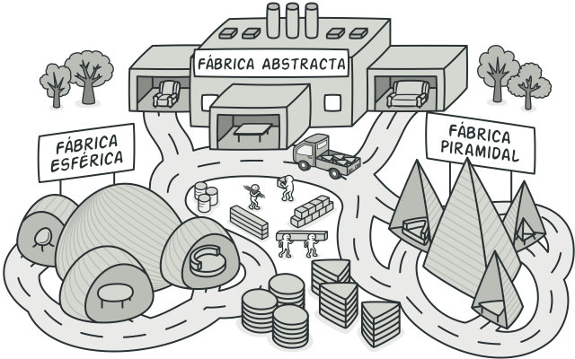

# Go Intermedio: Programación Orientada a Objetos y Concurrencia

# Indice
- [Structs como objetos](#Structs-como-objetos)
- [Interfaces y Composición](#Interfaces-y-Composición)
  - [Testing & Mocking](#Testing--Mocking)
- [Patron de Diseño Abstract Factory](#Patron-de-Diseño-Abstract-Factory)
- [Funciones Anónimas](#Funciones-Anónimas)
- [Funciones Variadicas y retornos con nombre](#Funciones-Variadicas-y-retornos-con-nombre)
- [Testing](#Testing)
- [Concurrencia](#Concurrencia)
  - [UnBuffered y Buffered Channels](#UnBuffered-y-Buffered-Channels)
  - [WaitGroup](#WaitGroup)
  - [Buffered Channels como semaforos](#Buffered-Channels-como-semaforos)
  - [Channels de Entrada y Salida](#Channels-de-Entrada-y-Salida)
  - [Worker Pools](#Worker-Pools)

# Structs como objetos

```go
package myclass

type Employee struct {
    Id       int
    Name     string
    Vacation bool
}

func NewEmployee(id int, name string, vacation bool) *Employee {
    return &Employee{
        Id:       id,
        Name:     name,
        Vacation: vacation,
    }
}

func (e *Employee) SetId(id int) {
    e.Id = id
}

func (e *Employee) SetName(name string) {

}

func (e *Employee) GetId() int {
    return e.Id
}

func (e *Employee) GetName() string {
    return e.Name
}
```
    
```go
package main

import (
    pk "GoIntermedio/myclass"
    "fmt"
)

func main() {
    // PRIMERA FORMA
    // Se instancia y se asigna valores
    e := pk.Employee{
        Id:       100,
        Name:     "Cristian Meoño",
        Vacation: true,
    }
    fmt.Printf("%v\n", e)
    
    // SEGUNDA FORMA
    // Se obtiene un puntero con new y luego se asignan valores
    e2 := new(pk.Employee)
    e2.Id = 200
    e2.Name = "Cristian Francisco"
    e2.Vacation = false
    fmt.Printf("%v\n", *e2)
    
    // TERCERA FORMA
    // Se usa el constructor
    e3 := pk.NewEmployee(1, "Cristian Meoño Canel", false)
    e3.SetId(85)
    fmt.Printf("%v\n", *e3)
    fmt.Print("\n\n")

}
```
    
# Interfaces y Composición

Go al no ser un lenguaje orientado a objetos hay que implementar la herencia con interfaces y composición

```go
package myclass2

import (
    "fmt"
    "time"
)

type Person struct {
    Name string
    Age  int
    DNI  string
}

type Employee struct {
    Id       int
    Vacation bool
    Position string
}

type FullTimeEmployee struct {
    Person
    Employee
    endDate string
}

type TemporaryEmployee struct {
    Person
    Employee
    taxRate int
}

type PrintInfo interface {
    getMessage() string
}

func (ftEmployee FullTimeEmployee) getMessage() string {
    return "Full Time Employee"
}

func (tEmployee TemporaryEmployee) getMessage() string {
    return "Temporary Employee"
}

func GetMessage(p PrintInfo) {
    fmt.Println(p.getMessage())
}

var GetPersonByDNI = func(dni string) (Person, error) {
    time.Sleep(5 * time.Second)
    return Person{}, nil
}

var GetEmployeeById = func(id int) (Employee, error) {
    time.Sleep(5 * time.Second)
    return Employee{}, nil
}

func GetFullTimeEmployeeById(id int, dni string) (FullTimeEmployee, error) {
    var ftEmployee FullTimeEmployee

    e, err := GetEmployeeById(id)
    if err != nil {
        return ftEmployee, err
    }
    ftEmployee.Employee = e

    p, err := GetPersonByDNI(dni)
    if err != nil {
        return ftEmployee, err
    }
    ftEmployee.Person = p

    return ftEmployee, nil

}
```
    
```go
package main

import (
    pk2 "GoIntermedio/myclass2"
    "fmt"
)

func main() {
    // POO - Usando Interfaces y Composicion
    ftEmployee := pk2.FullTimeEmployee{}
    ftEmployee.Name = "Cristian"
    pk2.GetMessage(ftEmployee)
    fmt.Printf("%v\n", ftEmployee)

    tEmployee := pk2.TemporaryEmployee{}
    pk2.GetMessage(tEmployee)
    fmt.Print("\n\n")

}
```
    
## Testing & Mocking

```go
package myclass2

import "testing"

func TestGetFullTimeEmployeeById(t *testing.T) {
    table := []struct {
        id               int
        dni              string
        mockFun          func()
        expectedEmployee FullTimeEmployee
    }{
        {
            id:  1,
            dni: "1",
            mockFun: func() {
                GetEmployeeById = func(id int) (Employee, error) {
                    return Employee{
                        Id:       1,
                        Position: "CEO",
                    }, nil
                }

                GetPersonByDNI = func(dni string) (Person, error) {
                    return Person{
                        Name: "Cristian",
                        Age:  35,
                        DNI:  "1",
                    }, nil
                }
            },
            expectedEmployee: FullTimeEmployee{
                Person: Person{
                    Name: "Cristian",
                    Age:  35,
                    DNI:  "1",
                },
                Employee: Employee{
                    Id:       1,
                    Position: "CEO",
                },
            },
        },
    }

    originalGetEmployeeById := GetEmployeeById
    originalGetPersonByDNI := GetPersonByDNI

    for _, test := range table {
        test.mockFun()
        ft, err := GetFullTimeEmployeeById(test.id, test.expectedEmployee.DNI)
        if err != nil {
            t.Errorf("Error when getting Employee")
        }

        if ft.Age != test.expectedEmployee.Age {
            t.Errorf("Error, got %d expected %d", ft.Age, test.expectedEmployee.Age)
        }

    }

    GetEmployeeById = originalGetEmployeeById
    GetPersonByDNI = originalGetPersonByDNI
}
```
    
# Patron de Diseño Abstract Factory



```go
package abstractfactory

import "fmt"

// Interfaces
type INotificationFactory interface {
    SendNotification()
    GetSender() ISender
}

type ISender interface {
    GetSenderMethod() string
    GetSenderChannel() string
}

// SMS
type SMSNotification struct {
}

func (SMSNotification) SendNotification() {
    fmt.Println("Sending Notification SMS")
}

func (SMSNotification) GetSender() ISender {
    return SMSNotificationSender{}
}

type SMSNotificationSender struct {
}

func (SMSNotificationSender) GetSenderMethod() string {
    return "SMS"
}

func (SMSNotificationSender) GetSenderChannel() string {
    return "Twilio"
}

//Email

type EmailNotification struct {
}

func (EmailNotification) SendNotification() {
    fmt.Println("Sending Notification Email")
}

func (EmailNotification) GetSender() ISender {
    return EmailNotificationSender{}
}

type EmailNotificationSender struct {
}

func (EmailNotificationSender) GetSenderMethod() string {
    return "Email"
}

func (EmailNotificationSender) GetSenderChannel() string {
    return "Amazon"
}

func GetNotificationFactory(notificationType string) (INotificationFactory, error) {
    if notificationType == "SMS" {
        return &SMSNotification{}, nil
    }
    if notificationType == "Email" {
        return &EmailNotification{}, nil
    }

    return nil, fmt.Errorf("No Notification Type")
}

func SendNotification(f INotificationFactory) {
    f.SendNotification()
}

func GetMethod(f INotificationFactory) {
    fmt.Println(f.GetSender().GetSenderChannel())
}
```
    
```go
package main

import (
    pk3 "GoIntermedio/abstractfactory"
    "fmt"
)

func main() {
    smsFactory, _ := pk3.GetNotificationFactory("SMS")
    emailFactory, _ := pk3.GetNotificationFactory("Email")

    pk3.SendNotification(smsFactory)
    pk3.SendNotification(emailFactory)

    pk3.GetMethod(smsFactory)
    pk3.GetMethod(emailFactory)
    fmt.Print("\n\n")

}
```
    
# Funciones Anónimas

```go
package main

import (
    "fmt"
    "time"
)

func main() {
    x := 5
    y := func() int {
        return x * 2
    }()
    fmt.Println(y)

    c := make(chan int)
    go func() {
        fmt.Println("Starting Function")
        time.Sleep(3 * time.Second)
        fmt.Println("End")
        c <- 1
    }()

    <-c
    fmt.Print("\n\n")

}

```
    
# Funciones Variadicas y retornos con nombre

```go
package main

import (
    "fmt"
)

func main() {
    fmt.Println(sum(1, 2, 3, 4, 5))
    printName("Cristian", "Francisco", "Meoño", "Canel")
    fmt.Println(getValues(2))
}

func sum(values ...int) int {
    total := 0
    for _, num := range values {
        total += num
    }
    return total
}

func printName(names ...string) {
    for _, name := range names {
        fmt.Println(name)
    }
}

func getValues(x int) (double int, triple int, quad int) {
    double = 2 * x
    triple = 3 * x
    quad = 4 * x

    return
}
```
    
# Testing

```go
package main

import "fmt"

func main() {
        fmt.Println(" ")
}

func sumToTest(x, y int) int {
    return x + y
}

func getMaxToTest(x, y int) int {
    if x < y {
        return y
    }
    return x
}

func fibonacciToTest(n int) int {
    if n <= 1 {
        return n
    }
    return fibonacciToTest(n-1) + fibonacciToTest(n-2)
}
```
    
```go
package main

import "testing"

// go test --coverprofile=coverage.out
// go tool cover --func=coverage.out
// go tool cover --html=coverage.out

// go test --cpuprofile=cpu.out
// go tool pprof cpu.out

func TestSum(t *testing.T) {
    tables := []struct {
        a int
        b int
        n int
    }{
        {1, 2, 3},
        {2, 2, 4},
        {25, 26, 51},
    }

    for _, item := range tables {
        total := sumToTest(item.a, item.b)

        if total != item.n {
            t.Errorf("Sum was incorrect, got %d expected %d", total, item.n)
        }
    }
}

func TestMax(t *testing.T) {
    tables := []struct {
        a int
        b int
        n int
    }{
        {4, 2, 4},
        {3, 2, 3},
        {3, 5, 5},
    }

    for _, item := range tables {
        max := getMaxToTest(item.a, item.b)

        if max != item.n {
            t.Errorf("Max was incorrect, got %d expected %d", max, item.n)
        }
    }
}

func TestFibonacci(t *testing.T) {
    tables := []struct {
        a int
        n int
    }{
        {1, 1},
        {8, 21},
    }

    for _, item := range tables {
        fib := fibonacciToTest(item.a)

        if fib != item.n {
            t.Errorf("Fibonacci was incorrect, got %d expected %d", fib, item.n)
        }
    }

}
```
    
# Concurrencia

## UnBuffered y Buffered Channels

- **Unbuffered channel**: Espera una función o una rutina para recibir el mensaje, es bloqueada por ser llamada en la misma función
- **Buffered channel**: Se puede llamar de manera inmediata, en el siguiente ejemplo 2 es el numero de canales que pueden ser usados

```go
package main

import "fmt"
func main() {

    // El tercer parametro es el buffer

    c1 := make(chan int, 1)
    c1 <- 1

    fmt.Println(<-c1)
}
```
    
## WaitGroup

Un WaitGroup espera que una colección de gorutinas terminen su trabajo. La gorutina de main llama Add para configurar el número de gorutinas por las que tiene que esperar. Luego cada una de las gorutinas corre y llama a Done cuando terminan. Al mismo tiempo, Wait puede ser usado para bloquear hasta que todas las gorutinas hayan finalizado.

```go
package main

import (
    "fmt"
    "sync"
    "time"
)

func main() {
    //WaitGroup
    var wg sync.WaitGroup

    for i := 0; i < 10; i++ {
        wg.Add(1)
        go doSomething(i, &wg)
    }

    wg.Wait()

}

func doSomething(i int, wg *sync.WaitGroup) {

    defer wg.Done()

    fmt.Printf("Started %d\n", i)
    time.Sleep(2)
    fmt.Println("Finished")

}
```
    
## Buffered Channels como semaforos

```go
package main

import (
    "fmt"
    "time"
    "sync"
)

func main() {
    //Usando Buffered Channels
    c2 := make(chan int, 5)
    var wg2 sync.WaitGroup

    for i := 0; i < 10; i++ {
        c2 <- 1
        wg2.Add(1)
        go doSomething2(i, &wg2, c2)
    }

    wg2.Wait()
    
}

func doSomething2(i int, wg *sync.WaitGroup, c chan int) {

    defer wg.Done()

    fmt.Printf("Started %d\n", i)
    time.Sleep(2 * time.Second)
    fmt.Printf("Finished %d\n", i)
    <-c

}
```
    
## Channels de Entrada y Salida


```go
package main

import "fmt"

//Si no definimos las que son de salida y entrada se produciran deadlock ya que tratataria de escribir y leer al mismo tiempo

func Generator(c chan<- int) {
    for i := 0; i < 10; i++ {
        c <- i
    }
    close(c)
}

func Double(cIn <-chan int, cOut chan<- int) {
    for v := range cIn {
        cOut <- 2 * v
    }
    close(cOut)
}

func Print(c <-chan int) {
    for value := range c {
        fmt.Printf("#%d\n", value)
    }
}

func main() {
    generator := make(chan int)
    doubles := make(chan int)

    go Generator(generator)
    go Double(generator, doubles)
    Print(doubles)
}
```
    
## Worker Pools

```go
package main

import (
    "fmt"
    "time"
    "sync"
)
func main() {

    tasks := []int{20, 30, 45, 10, 40}
    nWorkers := 5

    jobs := make(chan int, len(tasks))
    results := make(chan int, len(tasks))

    for i := 0; i < nWorkers; i++ {
        go Worker(i, jobs, results)
    }

    for _, value := range tasks {
        jobs <- value
    }
    close(jobs)

    for r := 0; r < len(tasks); r++ {
        <-results
    }
    
}

func Fibonacci(n int) int {
    if n <= 1 {
        return n
    }
    return Fibonacci(n-1) + Fibonacci(n-2)
}

func Worker(id int, jobs <-chan int, results chan<- int) {
    for job := range jobs {
        fmt.Printf("Worker with id %d started fib with %d\n", id, job)
        fib := Fibonacci(job)
        fmt.Printf("Worker with id %d job %d and fib %d\n", id, job, fib)
        results <- fib
    }
}
```


```go
package main

import (
    "fmt"
    "log"
    "net/http"
    "strconv"
    "time"
)

// Estructura de la tareas de procesar
type Job struct {
    Name   string        //Nombre de la tarea
    Delay  time.Duration //Tiempo de espera
    Number int           // Numero a procesar
}

type Worker struct {
    Id         int           // id del Worker
    JobQueue   chan Job      // Canal de tareas del worker
    WorkerPool chan chan Job //Canal de canales de tareas, este canal se comparte entre todos los workers
    QuitChan   chan bool     //Canal para parar al worker
}

type Dispatcher struct {
    WorkerPool chan chan Job //Canal de canales de tareas, este se les pasa a cada worker nuevo
    MaxWorkers int           //cantidad maxima de workers
    JobQueue   chan Job      //Canal de tareas, se puede ver como un canal global de tareas que despues se reparten entre workers
}

func NewWorker(id int, workerPool chan chan Job) *Worker {
    return &Worker{
        Id:         id,              //Se asigna un id
        WorkerPool: workerPool,      //Se le indica el canal donde tiene quie agregar su canal de tareas
        JobQueue:   make(chan Job),  //Canal de tareas del worker
        QuitChan:   make(chan bool), //Canal para parar al worker
    }
}

func (w Worker) Start() {

    //Se inicia de manera concurrente un ciclo sin fin
    go func() {
        for {

            //Al worker pool se manda el canal de worker, este se manda cada vez iteracion, es decir cuando el worker termino de hacer un jobs
            w.WorkerPool <- w.JobQueue

            //Se multiplexean los canales del worker
            select {
            case job := <-w.JobQueue:
                //Si se recibe un job en el canal de tareas del worker se ejecuta
                fmt.Printf("Worker with id %d Started\n", w.Id)
                fib := Fibonacci(job.Number)
                time.Sleep(job.Delay)
                fmt.Printf("Worker with id %d Finishes with result %d\n", w.Id, fib)

            case <-w.QuitChan:
                //Si se recibe un job en el canal de salida se para el worker (lo sca del ciclo)
                fmt.Printf("Worker with id %d Stopped\n", w.Id)
                return
            }

        }
    }()
}

//La funcion stop manda un true al canal de salida del worker
func (w Worker) Stop() {
    go func() {
        w.QuitChan <- true
    }()
}

//El dispatcher cuenta con el el canal global de jobs y un canal de todos los canales de los workers

func NewDispatcher(jobQueue chan Job, maxWorkers int) *Dispatcher {

    worker := make(chan chan Job, maxWorkers)
    return &Dispatcher{
        JobQueue:   jobQueue,
        MaxWorkers: maxWorkers,
        WorkerPool: worker,
    }
}

func (d *Dispatcher) Dispatch() {

    //Inicia de manera indefinidad a mandar jobs a los canales que se van recibiendo en el canal de caneles de jobs
    for {
        select {
        case job := <-d.JobQueue:
            go func() {
                workerJobQueue := <-d.WorkerPool
                workerJobQueue <- job
            }()
        }
    }
}

// se crean workers y se inicia el dispatcher
func (d *Dispatcher) Run() {
    for i := 0; i < d.MaxWorkers; i++ {
        worker := NewWorker(i, d.WorkerPool)
        worker.Start()
    }

    go d.Dispatch()
}

func RequestHandler(w http.ResponseWriter, r *http.Request, jobQueue chan Job) {
    if r.Method != "POST" {
        w.Header().Set("Allow", "POST")
        w.WriteHeader(http.StatusMethodNotAllowed)
    }

    delay, err := time.ParseDuration(r.FormValue("delay"))
    if err != nil {
        http.Error(w, "Invalid Delay", http.StatusBadRequest)
        return
    }

    value, err := strconv.Atoi(r.FormValue("value"))
    if err != nil {
        http.Error(w, "Invalid Value", http.StatusBadRequest)
        return
    }

    name := r.FormValue("name")
    if name == "" {
        http.Error(w, "Invalid Value", http.StatusBadRequest)
        return
    }

    job := Job{Name: name, Delay: delay, Number: value}
    jobQueue <- job
    w.WriteHeader(http.StatusCreated)
}

func main() {
    const (
        maxWorkers   = 4
        masQueueSize = 20
        port         = ":8081"
    )

    jobQueue := make(chan Job, masQueueSize)
    dispatcher := NewDispatcher(jobQueue, maxWorkers)

    dispatcher.Run()

    http.HandleFunc("/fib", func(w http.ResponseWriter, r *http.Request) {
        RequestHandler(w, r, jobQueue)
    })

    log.Fatal(http.ListenAndServe(port, nil))

}

func Fibonacci(n int) int {
    if n <= 1 {
        return n
    }

    return Fibonacci(n-1) + Fibonacci(n-2)
}
```